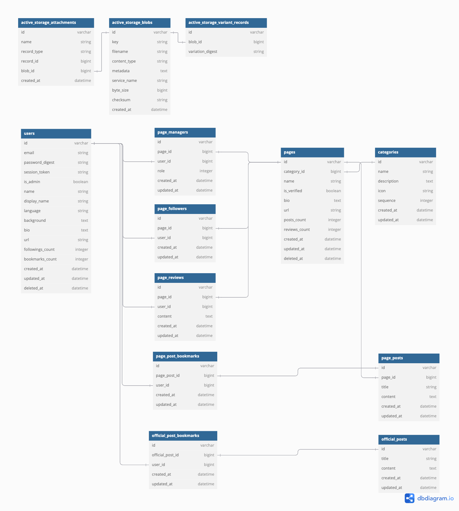
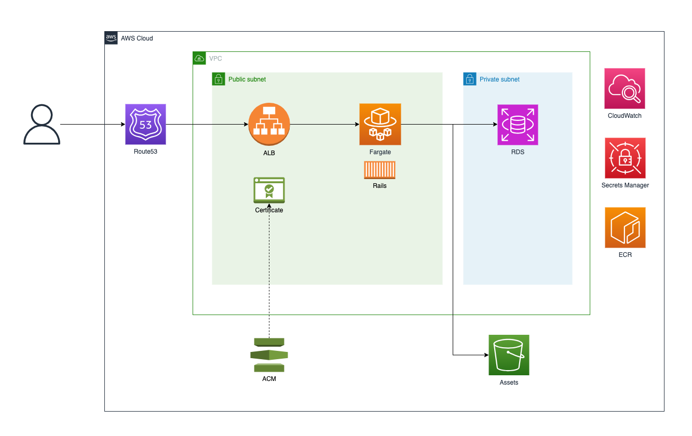

# hub

## install tools and runtimes

* install [docker](https://docs.docker.com/get-docker/) for running database
* install [asdf](https://asdf-vm.com/guide/getting-started.html) for managing runtimes
* $ `asdf plugin-add ruby`
* $ `asdf plugin-add nodejs`
* $ `asdf plugin-add awscli`
* $ `asdf install`
* $ `brew install vips` # for image processing

## setup
* $ `docker-compose up -d`
* $ `bundle install`
* $ `./bin/rails db:create db:migrate db:seed`
* $ `./bin/dev`
* access http://localhost:3079

## deploy
* $ `make push` # push rails image to ECR
* $ `cd cdk`
* copy image tag from output and update `imageTag` in `cdk/lib/hub-stack.ts`
* $ `make diff` # run cdk diff
* $ `make deploy` # run cdk deploy

## other commands
* $ `cd cdk`
* $ `make exec` # ecs exec
* $ `make rds-ssh` # ssh to bastion host and connect to RDS

## database schema

## infra architecture

